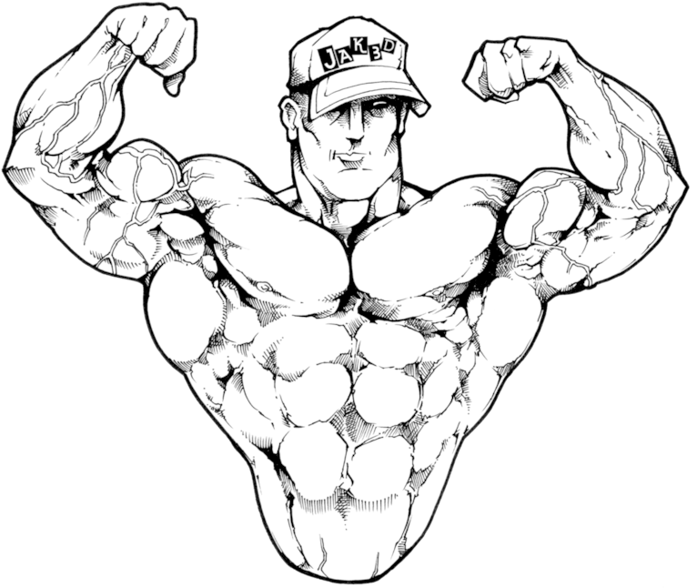

<h1 align="center">
   ♻️ App Double Biceps
</h1>
<h1 align="center">
    
</h1>

<h4 align="center">
  🚀 Trabalho De DWS
</h4>

  
  

## 👨🏼‍💻 Projeto

O Dublebiceps é uma aplicação que visa facilitar o encontro entre vendedores de suplemento e empresas. Nele é possível empresas vender os suplementos de academia para vendedores locais, onde os vendedores possam usar como portifolio de vendas. Foi desenvolvida par Aula de DWS a.

## 🔨 Tecnologias

-   [JavaScript](https://developer.mozilla.org/pt-BR/docs/Aprender/JavaScript)
-   [Node.js](https://nodejs.org/en/)
-   [React](https://pt-br.reactjs.org/)
-   [React Native](https://reactnative.dev/)
-   [Expo](https://expo.io/)
-   [MongoDB](https://www.mongodb.org)

### 🔧 Back-end (server)

-   Entrar na pasta `server`;
-   Executar `npm install` para instalar dependências do projeto;
-   Executar `npm start` para que o projeto seja executado;

### 💻 Client Front-end

-   Entrar na pasta `client`;
-   Executar `npm install` para instalar dependências do projeto;
-   Executar `npm start` para que o projeto seja executado;
### 💻 Admin front-end

-   Entrar na pasta `admin`;
-   Executar `npm install` para instalar dependências do projeto;
-   Executar `npm start` para que o projeto seja executado;

## ♻️ Como contribuir

-   Faça um fork desse repositório;
-   Crie uma branch com a sua feature: `git checkout -b minha-feature`
-   Commit suas mudanças: `git commit -m ':emoji: feat: My new feature'`
-   Push a sua branch: `git push origin my-feature`

## 📝 Licença

Este projeto está sobre a licença MIT. Veja o arquivo [LICENSE](LICENSE.md) para mais detalhes.

---

<h4 align="center">
  Feito com ❤️ by Victor G Paravatti & Adriano Rosa & Pedro Calasans & Lucas Bandeira & Demetrios Pantaleão
