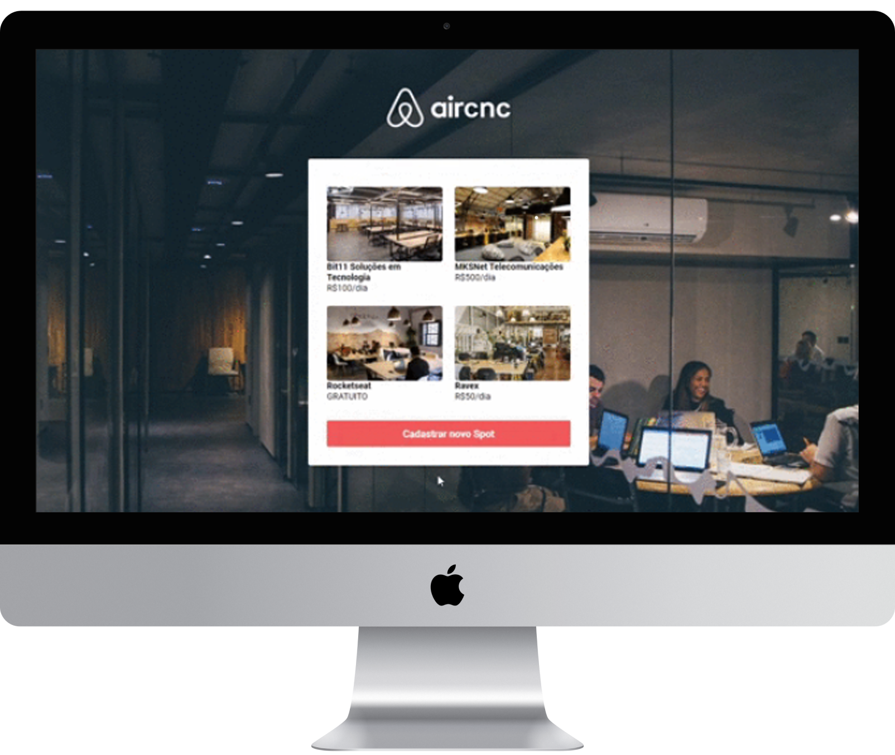

<h1 align="center">
    
</h1>

<h4 align="center">
  🚀 Semana OmniStack 9.0 by RocketSeat
</h4>

  
  

## 📱 Interfaces

A aplicação frontend é utilizado pelas empresas para realizar o cadastros de seus `spots`. É nele onde são feito os cadastro das imagens e demais informações. Além disso, é nessa interface que as empresas aceitam ou rejeitam as propostas dos desenvolvedores.

    

## 🔄 Executar

- Entrar na pasta `frontend`;
- Executar `yarn install` para instalar dependências do projeto;
- Executar `yarn start` para que o projeto seja executado;

## 📝 Licença

Este projeto está sobre a licença MIT. Veja o arquivo [LICENSE](../LICENSE.md) para mais detalhes.

---

<h4 align="center">
  Feito com ❤️ by Gustavo Souza
</h4>
